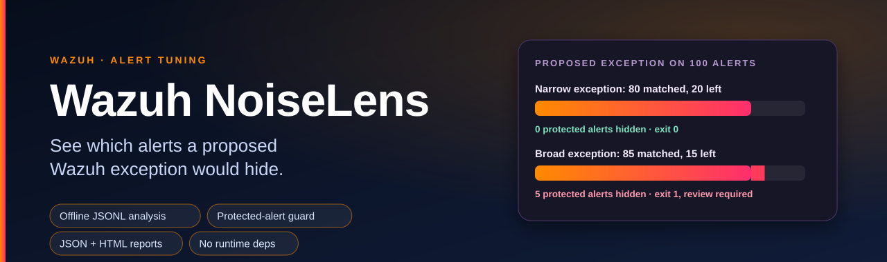
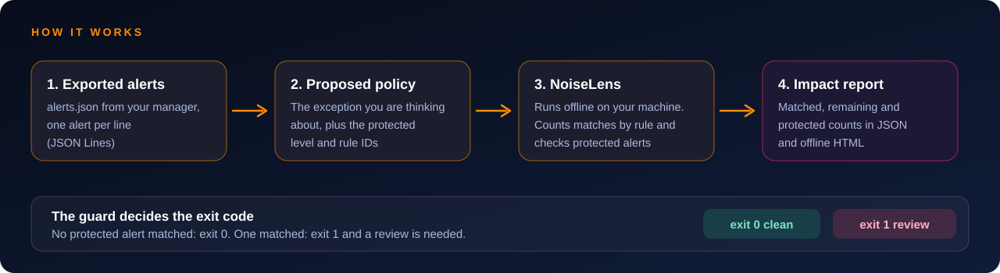
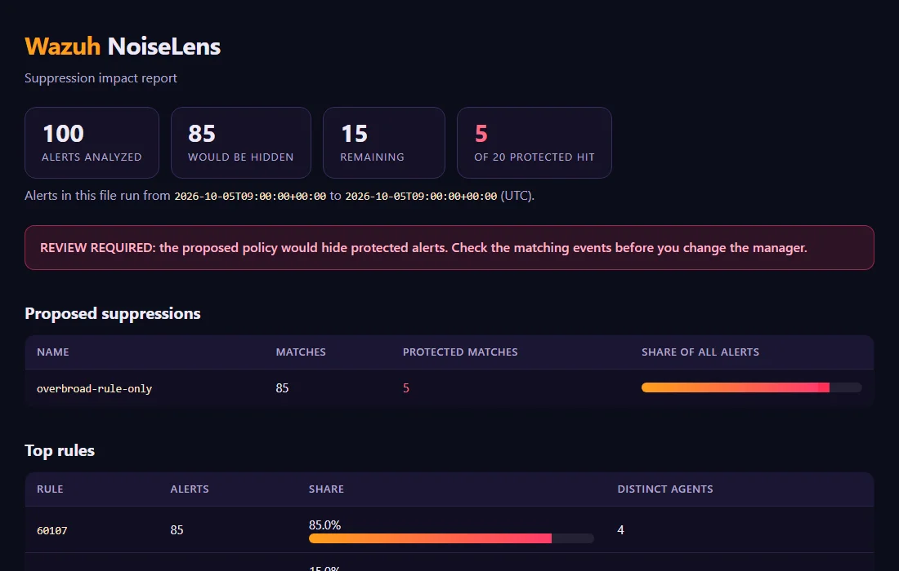

<h1 align="center"></h1>

<p align="center">
  <a href="https://github.com/farhan6667/wazuh-noiselens/actions/workflows/ci.yml"></a>
  <a href="LICENSE"></a>
  
  
  
</p>

**Wazuh NoiseLens is an open source command line tool for Python 3.10+ that reads an exported Wazuh alerts file, counts alerts by rule and shows which alerts a proposed suppression would hide, including protected ones.** Independent project by Syed Farhan Ahmed (SFA) at NexaForge. It is not affiliated with, sponsored by or endorsed by Wazuh Inc.


See which alerts a proposed Wazuh exception would hide.

NoiseLens reads an exported `alerts.json` file on your workstation. It counts
alerts by rule and measures how a proposed exception would affect that dataset.
If the exception matches a protected alert, the command exits with a review failure.

Requires Python 3.10 or newer, with no runtime dependencies. Analysis runs offline.

Version 0.2.0 is a prototype. Local unit and CLI tests pass with synthetic data.
Testing with representative, sanitized operator data is still pending.

## At a glance

| | |
|---|---|
| **Analyzes** | An exported Wazuh alerts.json file, offline, on your workstation |
| **Measures** | Matches per rule, share of volume, distinct agents, remaining alerts, with a readable offline HTML report and a Markdown summary |
| **Guards** | Exits 1 when a proposed exception would hide a protected alert |
| **Helps you write** | `--breakdown` lists the most common values of a field for one rule, so you can build a narrow exception from your own data |
| **Runs on** | Python 3.10+, no runtime dependencies, no network use |
| **Status** | Prototype. Testing with real, sanitized operator data is still pending |

## Before suppressing a noisy rule

A busy rule may contain both routine activity and events worth investigating.
NoiseLens lets you test a narrower exception against an export and inspect what
it matches, including alerts with high severity or rule IDs you've protected.

Volume alone doesn't tell you whether an alert is a false positive. You still
need to review the matching events and test an approved exception on a manager.
NoiseLens measures the proposed impact and leaves that decision with you.

## How it works

<p align="center"></p>

## Run the demo

```sh
python -m noiselens examples/alerts.jsonl --json audit.json --html audit.html
python -m noiselens examples/alerts.jsonl --policy examples/narrow-policy.json --json narrow.json --html narrow.html
python -m noiselens examples/alerts.jsonl --policy examples/broad-policy.json --json broad.json --html broad.html
```

The synthetic dataset has 100 alerts. The narrow example matches 80 and leaves 20,
with no protected matches. The broad example matches 85, including 5 protected alerts:
it produces a report and exits 1 (**review required**).
This teaches the guard, not a production recommendation for rule 60107.

Install with `python -m pip install .`, then use `noiselens` instead of `python -m noiselens`.

## What a report looks like

The HTML report is one offline file with no scripts and no remote assets. This is the broad demo policy: it hides 85 of 100 alerts, and 5 of them are protected.

<p align="center"></p>

Add `--markdown summary.md` to get the same result as a table for `$GITHUB_STEP_SUMMARY` or a pull request comment.

## Find a narrow exception from your own data

A broad exception on a busy rule is how protected alerts get hidden. To build a narrow one, look at what the noisy rule actually contains:

```sh
noiselens examples/alerts.jsonl --json audit.json --breakdown 60107:data.win.eventdata.processName
```

```text
Top values of data.win.eventdata.processName for rule 60107: 85 alerts, 2 distinct values, 0 without that field
      80  C:\Tools\approved.exe
       5  C:\Unknown\unreviewed.exe
These values are shown on this terminal only. They are never written to a report.
```

Eighty alerts come from one reviewed program and five from one nobody reviewed. An exception on `rule 60107` alone hides both. An exception that also requires `processName` to equal the reviewed path hides only the first. Put that in a policy and run NoiseLens again to confirm the protected count stays at zero.

The breakdown prints field values, which can be sensitive, so they stay on your terminal and out of the reports. Control characters in a value are replaced before they are printed, and long values are cut.

## Check a policy in your editor

The policy file has a JSON Schema, so VS Code and similar editors can flag a typo in a key as you type. Add `"$schema": "https://raw.githubusercontent.com/farhan6667/wazuh-noiselens/main/noiselens/policy.schema.json"` to the policy, or print the schema offline with `noiselens --print-schema`.

## Use it with Wazuh RuleGuard

The two tools cover both halves of tuning. NoiseLens answers "what would this exception hide in my alerts?". After you write the exception, [Wazuh RuleGuard](https://github.com/farhan6667/wazuh-ruleguard) answers "do the detections I care about still fire, and does the noisy one stay quiet?". Keep one sample of each kind in a RuleGuard suite and run both before you change the manager.

## Run it in a container

Each release publishes an image to GitHub Packages, so you can run NoiseLens without installing Python:

```sh
docker run --rm --user "$(id -u):$(id -g)" -v "$PWD:/work" ghcr.io/farhan6667/wazuh-noiselens   examples/alerts.jsonl --json audit.json
```

The image runs as a non-root user, needs no network, and contains only NoiseLens. Mount the folder with your exported alerts.

## Your data

Copy a representative, authorized Wazuh `alerts.json` export to your analysis workstation:

```sh
noiselens alerts.json --policy reviewed-exceptions.json --top 20 --json impact.json --html impact.html
```

Inputs must be JSON Lines: one alert object per line, or one indexer document with an
`_source` object per line. `rule.id` must be a string; `rule.level` must be an integer.
`agent.id`, if present, must be a string. A whole indexer search-response wrapper is not accepted:
export its `_source` documents one per line first.

## Policy

```json
{
  "schema_version": 1,
  "protected_level": 12,
  "protect_rule_ids": ["100900"],
  "suppressions": [{
    "name": "reviewed-process-only",
    "rule_ids": ["60107"],
    "equals": {"data.win.eventdata.processName": "C:\\Tools\\approved.exe"}
  }]
}
```

Each suppression must name one or more rule IDs. An alert matches only when
its rule ID and every `equals` predicate match. Multiple suppressions are combined
with OR, and overlapping matches count once in the overall total.

Comparisons use exact values, including letter case and value type. Predicates
use dotted paths to reach nested fields. Missing fields don't match, and literal
dots in field names aren't supported. Null predicates, regex, wildcards and fuzzy
matching aren't supported either.

An alert at or above `protected_level`, or with a named protected rule ID, triggers
a review failure if it matches a suppression.

The policy is an analysis contract, not deployable Wazuh XML. Translate any approved exception
manually and verify its behavior with the real engine before deployment.

## Reports

Rule counts, volume share, distinct reporting agents, severity distribution, union suppression
count, remaining alerts, and protected matches per proposed exception. Reports exclude raw
logs, descriptions, process paths and agent identifiers. Chosen suppression names and rule IDs
are included. HTML is escaped and works offline without scripts or remote assets.

Exit codes: 0 analysis complete/no protected matches, 1 proposed policy matches protected
alerts, 2 invalid input/policy/output error, 130 interrupted. Invalid input aborts without
writing a new partial report. Input/output path collisions are refused.

## Important limits

A guard pass only means no protected alerts in this dataset matched. It does not establish
that an exception is safe on unseen traffic. Pick a representative time window and include
known incidents and benign operations. Severity is an safeguard selected by the operator, not ground
truth for maliciousness. No logs that produced no alerts are included, so missed detections cannot be measured.

Duplicate records are counted separately; use exports without overlapping records or deduplicate upstream.
No filtering by timestamp or trend inference is performed. The tool streams records, but
rule counters and distinct rule/agent combinations grow in memory with data cardinality.
No data is sent over the network; SQLite stores aggregation keys in memory.

## Development and related work

```sh
python -m unittest discover -s tests -v
```

Other projects such as [solsoc](https://github.com/luis-troccoli/solsoc) and
[local_siem_agent](https://github.com/u9u-p/local_siem_agent) tackle triage with language models.
NoiseLens focuses on reproducible impact of proposed suppressions, with no model or API dependency.
The two approaches can coexist. Read [contribution notes](CONTRIBUTING.md) and [security notes](SECURITY.md) before submitting samples.


For the demo commands and expected results, see [the demo guide](docs/demo.md).

## Contribute

This project is free and built in the open, and I would like it to be shaped by people who run Wazuh every day. The most useful things you can send:

- a **compatibility report** from a real Wazuh 4.x manager (the demos are synthetic, so this is the biggest gap),
- a **synthetic example** that matches a log source you know,
- a fix, a test, or a clearer sentence in the docs.

Start with a [good first issue](https://github.com/farhan6667/wazuh-noiselens/labels/good%20first%20issue) or say hello in [Discussions](https://github.com/farhan6667/wazuh-noiselens/discussions). The [contributing guide](CONTRIBUTING.md) explains the two minute setup. It carries the `hacktoberfest` topic, and pull requests are welcome whether or not you take part.

## Frequently asked questions

### How do I see what a Wazuh suppression would hide?
Export your alerts as `alerts.json`, write the exception as a small JSON policy and run `noiselens`. It counts how many alerts the exception matches, how many remain, and whether any alert you marked as protected would disappear.

### Can it tell me which alerts are false positives?
No. Volume alone does not make an alert noise. NoiseLens measures the impact of a proposed exception on your own data, and you still review the matching events before deciding.

### How do I find a narrow exception instead of silencing the whole rule?
Run `noiselens alerts.jsonl --json out.json --breakdown RULE_ID:field.path`. It prints the most common values of that field for that rule, for example which process names produce the noise. Build the exception on the reviewed value, put it in a policy and run NoiseLens again to check that no protected alert matches.

### What input does it read?
JSON Lines: one alert per line, or one indexer document with a `_source` object per line. A whole search-response wrapper is not accepted, so export the `_source` documents one per line first.

### What does exit code 1 mean?
The proposed policy matches at least one protected alert, so a person needs to review it. Exit 0 means the analysis finished with no protected match in that dataset. That is not proof the exception is safe on traffic you have not seen.

### Does it change my Wazuh configuration?
No. It only analyses a file. The policy is an analysis contract, not deployable Wazuh XML, so translate an approved exception by hand and test it on a manager.

### Does it send data anywhere?
No. It runs offline on your workstation, and the reports leave out raw logs, descriptions, process paths and agent identifiers.

### Is it ready for production?
Not yet. It is a prototype tested with synthetic data. Testing with sanitized real operator data is still pending.

### Is it an official Wazuh tool?
No. It is an independent project and is not affiliated with Wazuh Inc.

## License

[Apache-2.0](LICENSE). See [NOTICE](NOTICE) for the attribution and trademark note.

---

<div align="center">

<a href="https://nexaforge.eu.cc/">
  <picture>
    <source media="(prefers-color-scheme: dark)" srcset="docs/img/brand/nexaforge-lockup-dark.webp">
    
  </picture>
</a>
&nbsp;&nbsp;
<a href="https://farhan6667.github.io/portfolio/"></a>

**Built by [Syed Farhan Ahmed](https://github.com/farhan6667) (SFA)** at **[NexaForge](https://nexaforge.eu.cc/)**<br>
Cyber security · Vibe coding · Web development and IT infrastructure

[Website](https://nexaforge.eu.cc/) ·
[LinkedIn](https://www.linkedin.com/in/sfa6667) ·
[Portfolio](https://farhan6667.github.io/portfolio/) ·
[Email](mailto:nexaforge.services@gmail.com)

</div>
